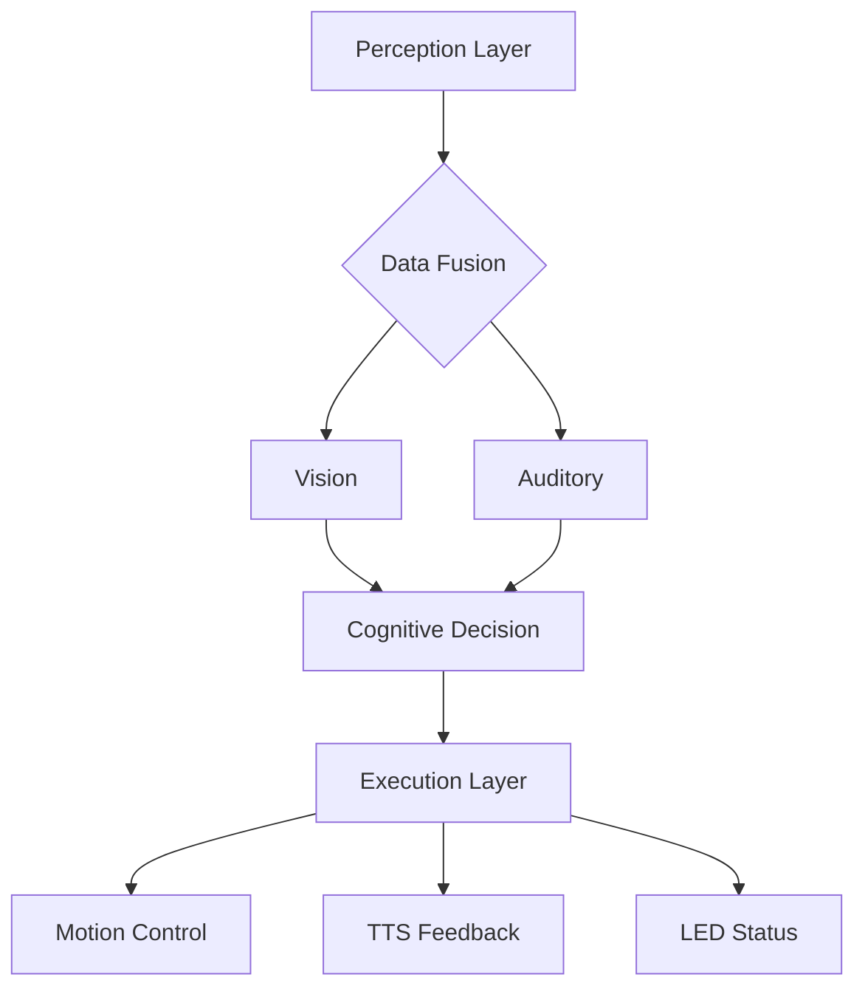
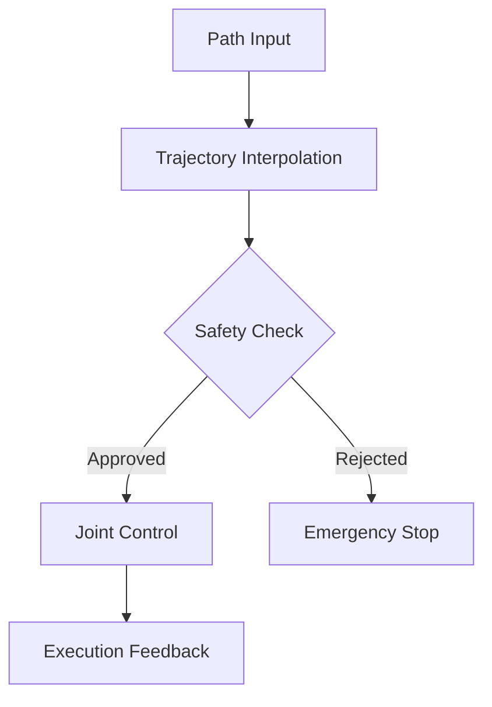
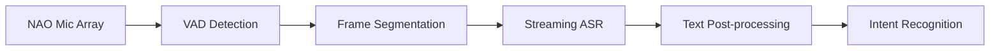
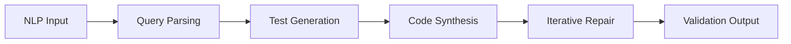
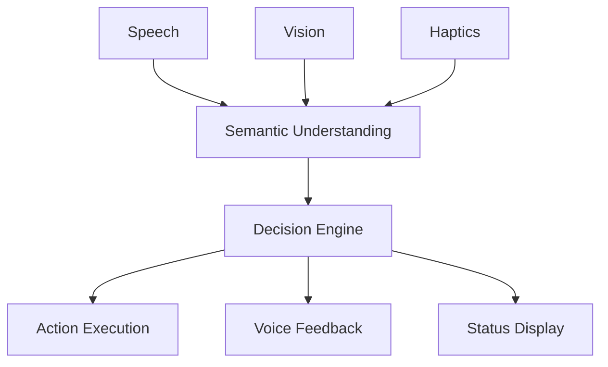
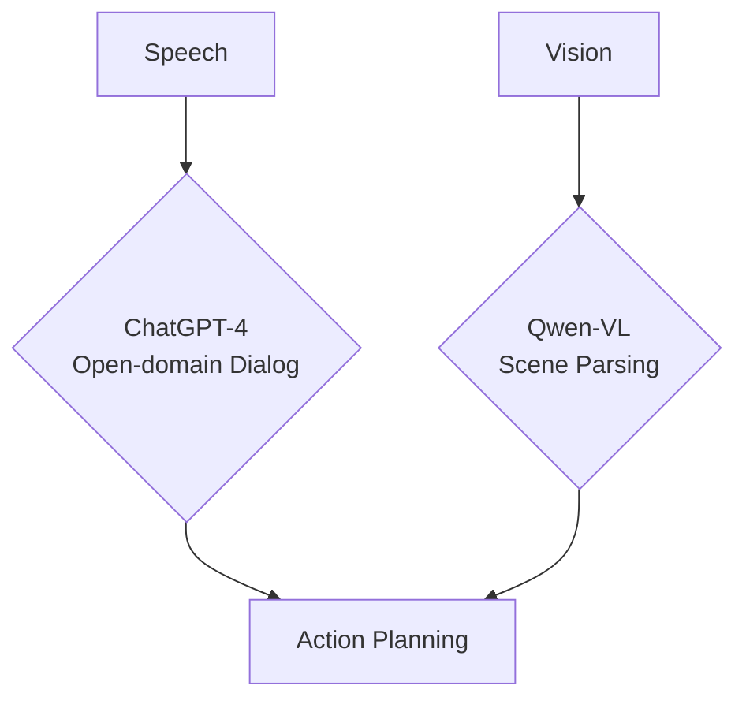
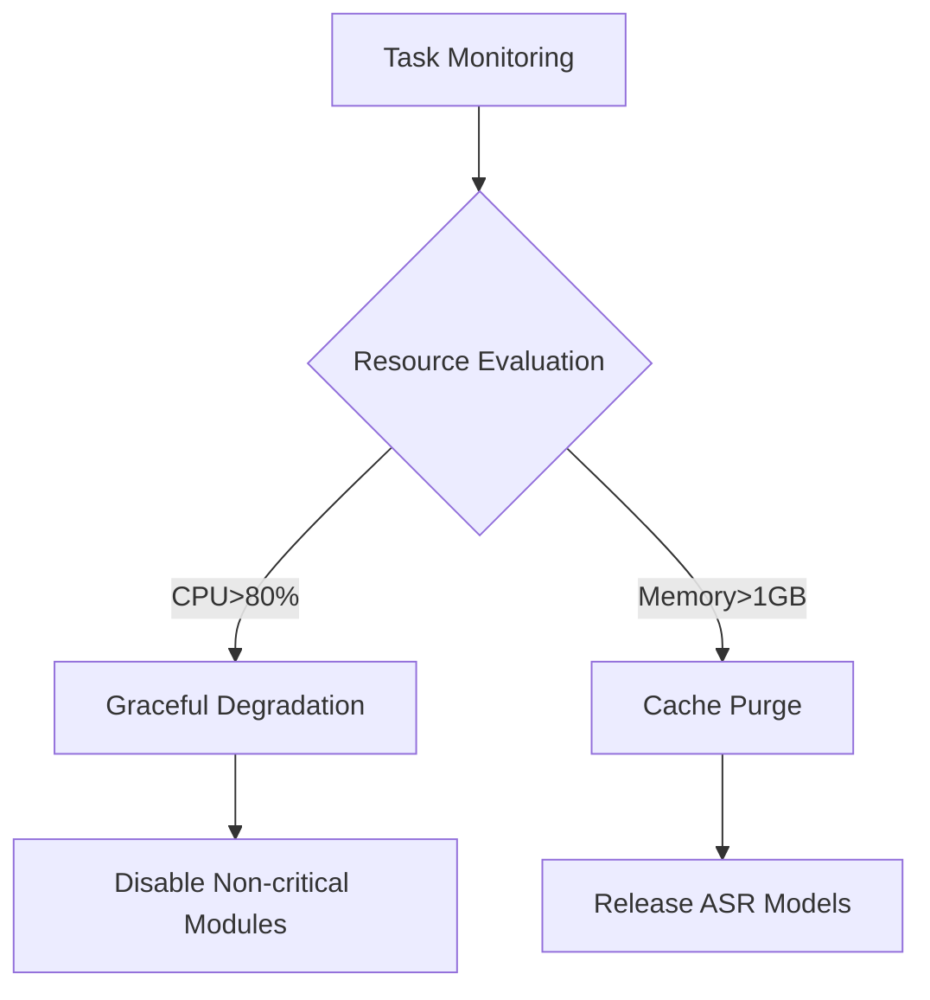

# Project Design

## Project Description

With the acceleration of global aging trends (WHO predicts 22% of the population will be aged 60+ by 2050), traditional service robots exhibit significant limitations in interaction flexibility, environmental adaptability, and dynamic responsiveness. This project proposes an **embodied intelligence**-driven companion robot system that seamlessly integrates **Large Language Models (LLMs)** with multimodal interaction frameworks, designed to achieve human-like naturalness and cognitive intelligence in HRI (Human-Robot Interaction) for personalized elderly companionship services.

The system leverages ChatGPT-4 and Tongyi's Qwen as standalone AI cores for different operational scenarios. ChatGPT-4 primarily handles open-domain conversational reasoning, while Qwen specializes in context-aware Chinese language processing, enabling complementary cognitive capabilities without model fusion.

As a **Qi3 framework-powered embodied intelligence solution** implemented on the NAO humanoid robot, this project utilizes its integrated motionControl, vision, and auditory perception modules to demonstrate embodied intelligence applications in healthcare and educational fields. The research not only drives robotics innovation but also offers empirical verification for interdisciplinary systems engineering paradigms (hardware-algorithm co-design).

## Installation

### Dependencies

Linux/Windows-wsl/MacOS
Python3.7+
Libqi-Python

### From Source

pip3 install -r requirements.txt

Run audioprocessing.py on the robot

### Design Requirements

#### 0. Robot Architecture



#### 1. Motion Module



---

#### 2. Vision Module (ORB-SLAM3)


#### 3. Auditory Module (FastASR)



---

#### 4. Navigation Module (ROS2 Navigation)


---

#### 5. Code Generation Module (Core)



---

#### 6. Multimodal Interaction Module



## Process
### Implementation Framework

1. **Environment Modeling**:

   - Dynamic point cloud mapping

2. **Human-Robot Interaction**:

   - Full-duplex communication protocol (interruption threshold: -30dB)
   - Emotion recognition (voice spectrum + facial expression analysis)

3. **System Integration**:

   ```mermaid
   sequenceDiagram
       User->>ASR: Voice Command
       ASR->>LLM: Text Input
       LLM->>Navigation: Target Coordinates
       Navigation->>Motion Control: Path Sequence
       Motion Control-->>User: Execution Feedback
   ```

4. **Resource Management**:



Development Roadmap
AI Evolution Strategy:

ChatGPT-4 Specialization: Expand plugin system integration for NAO-specific APIs
Qwen Optimization: Develop lightweight variants for real-time Chinese ASR-NLU pipelines
Ethical AI: Implement model-agnostic content safety filters
Edge Deployment: Explore ONNX runtime optimization for both models

### Experimental Plan

### Real-time Guarantee

### Safety Design

## Final Project Deliverables

### 1. Model Validation Report
### 2. Scenario Testing Results

## License

This project is licensed under the MIT License.
