# Project Design

## Project Description

With the acceleration of global aging trends (WHO predicts 22% of the population will be aged 60+ by 2050), traditional service robots exhibit significant limitations in interaction flexibility, environmental adaptability, and dynamic responsiveness. This project proposes an **embodied intelligence**-driven companion robot system that seamlessly integrates **Large Language Models (LLMs)** with multimodal interaction frameworks, designed to achieve human-like naturalness and cognitive intelligence in HRI (Human-Robot Interaction) for personalized elderly companionship services.

The system leverages ChatGPT-4 and Tongyi's Qwen as standalone AI cores for different operational scenarios. ChatGPT-4 primarily handles open-domain conversational reasoning, while Qwen specializes in context-aware Chinese language processing, enabling complementary cognitive capabilities without model fusion.

As a **Qi3 framework-powered embodied intelligence solution** implemented on the NAO humanoid robot, this project utilizes its integrated motionControl, vision, and auditory perception modules to demonstrate embodied intelligence applications in healthcare and educational fields. The research not only drives robotics innovation but also offers empirical verification for interdisciplinary systems engineering paradigms (hardware-algorithm co-design).

## Installation

### Dependencies

Linux/Windows-wsl/MacOS
Python3.7+
Libqi-Python

### From Source

pip3 install -r requirements.txt

Run audioprocessing.py on the robot

### Design Requirements

#### 0. Robot Architecture
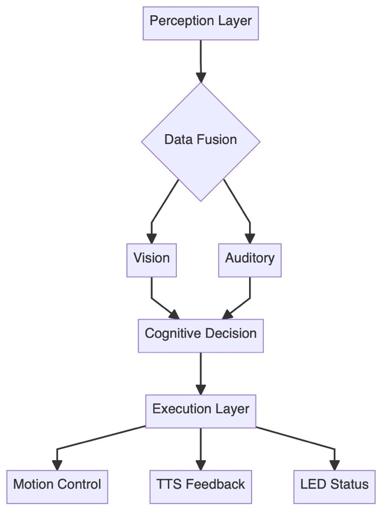
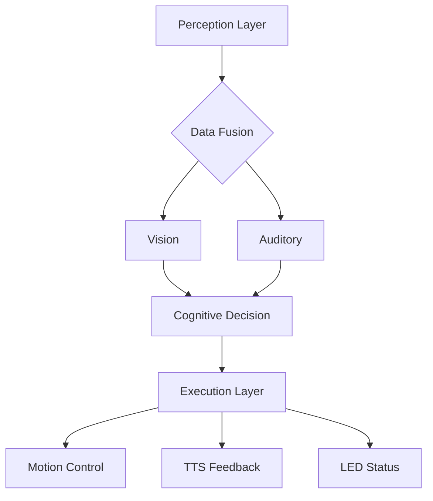
```mermaid
graph TD
    A[Perception Layer] --> B{Data Fusion}
    B --> C[Vision]
    B --> D[Auditory]
    C --> E[Cognitive Decision]
    D --> E
    E --> F[Execution Layer]
    F --> G[Motion Control]
    F --> H[TTS Feedback]
    F --> I[LED Status]
```

#### 1. Motion Module
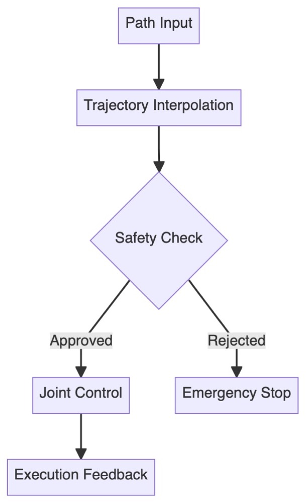

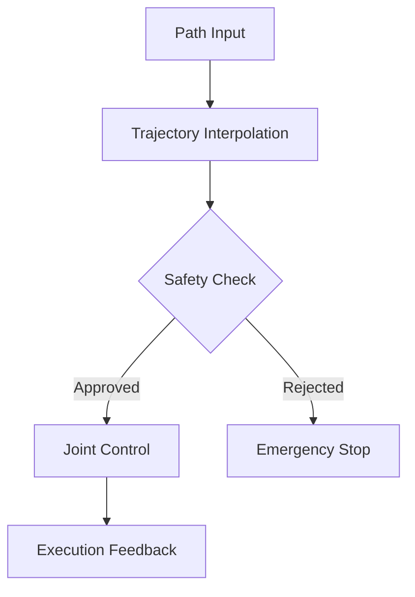
```mermaid
graph TD
    A[Path Input] --> B[Trajectory Interpolation]
    B --> C{Safety Check}
    C -->|Approved| D[Joint Control]
    C -->|Rejected| E[Emergency Stop]
    D --> F[Execution Feedback]
```

---

#### 2. Vision Module (ORB-SLAM3)
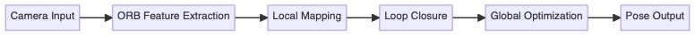

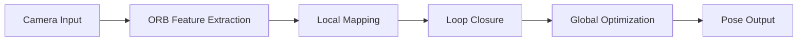
```mermaid
graph LR
    A[Camera Input] --> B[ORB Feature Extraction]
    B --> C[Local Mapping]
    C --> D[Loop Closure]
    D --> E[Global Optimization]
    E --> F[Pose Output]
```

#### 3. Auditory Module (FastASR)
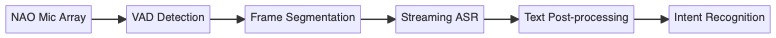

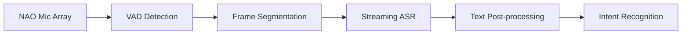
```mermaid
graph LR
    A[NAO Mic Array] --> B[VAD Detection]
    B --> C[Frame Segmentation]
    C --> D[Streaming ASR]
    D --> E[Text Post-processing]
    E --> F[Intent Recognition]
```

---

#### 4. Navigation Module
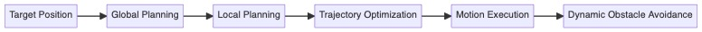

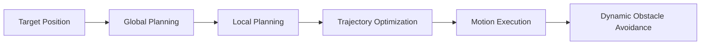
```mermaid
graph LR
    A[Target Position] --> B[Global Planning]
    B --> C[Local Planning]
    C --> D[Trajectory Optimization]
    D --> E[Motion Execution]
    E --> F[Dynamic Obstacle Avoidance]
```

---

#### 5. Code Generation Module (Core)
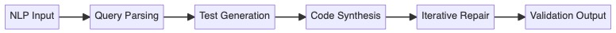

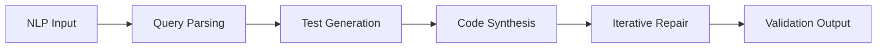
```mermaid
graph LR
    A[NLP Input] --> B[Query Parsing]
    B --> C[Test Generation]
    C --> D[Code Synthesis]
    D --> E[Iterative Repair]
    E --> F[Validation Output]
```

---

#### 6. Multimodal Interaction Module
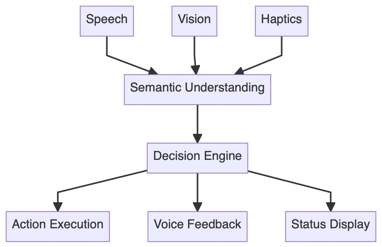

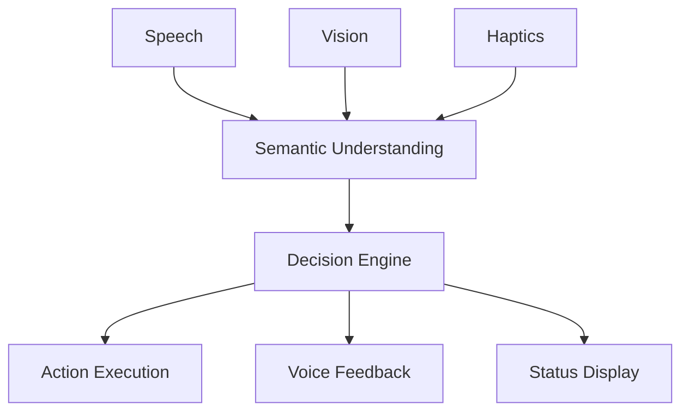
```mermaid
graph TB
    A[Speech] --> C[Semantic Understanding]
    B[Vision] --> C
    D[Haptics] --> C
    C --> E[Decision Engine]
    E --> F[Action Execution]
    E --> G[Voice Feedback]
    E --> H[Status Display]
```
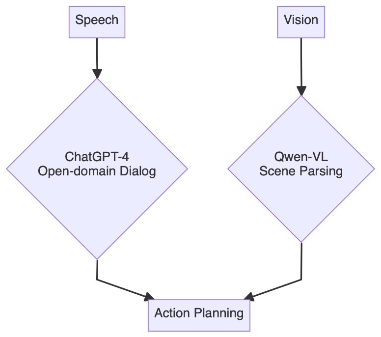

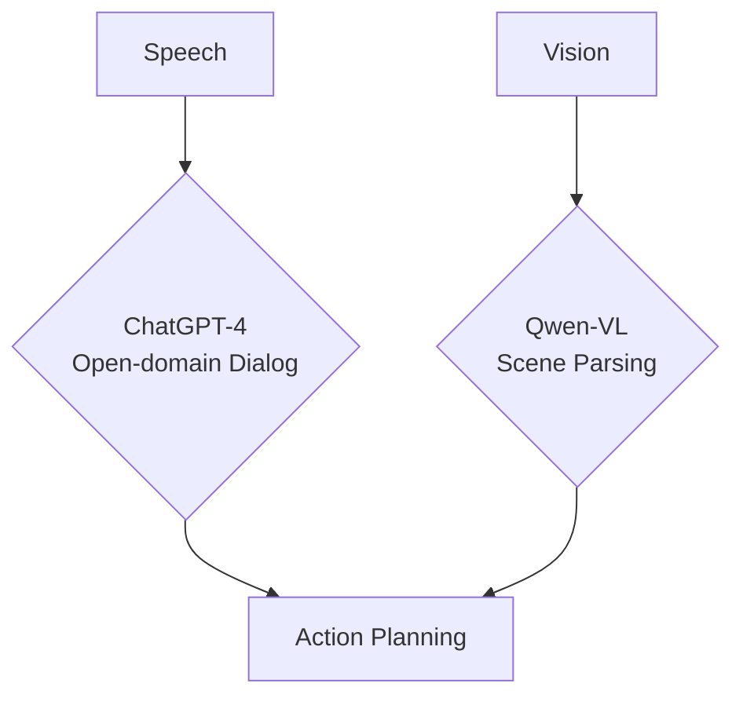
```mermaid
flowchart TD  
    A[Speech] --> B{ChatGPT-4\nOpen-domain Dialog}  
    C[Vision] --> D{Qwen-VL\nScene Parsing}  
    B --> E[Action Planning]  
    D --> E  
```
## Process
### Implementation Framework

1. **Environment Modeling**:

   - Dynamic point cloud mapping

2. **Human-Robot Interaction**:

   - Full-duplex communication protocol (interruption threshold: -30dB)
   - Emotion recognition (voice spectrum + facial expression analysis)

3. **System Integration**:
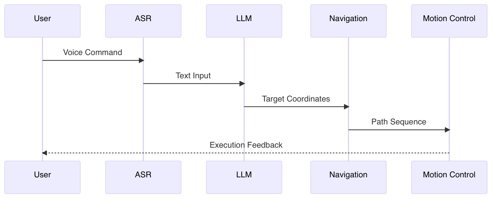

   ```mermaid
   sequenceDiagram
       User->>ASR: Voice Command
       ASR->>LLM: Text Input
       LLM->>Navigation: Target Coordinates
       Navigation->>Motion Control: Path Sequence
       Motion Control-->>User: Execution Feedback
   ```

4. **Resource Management**:
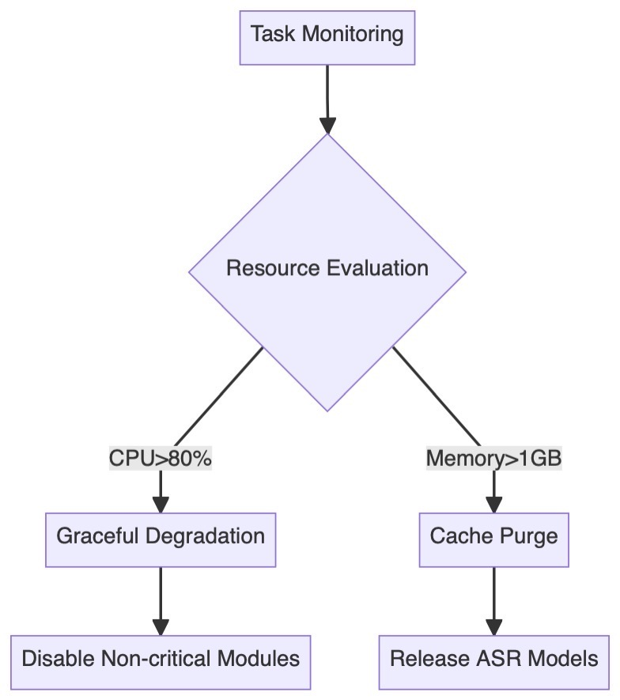

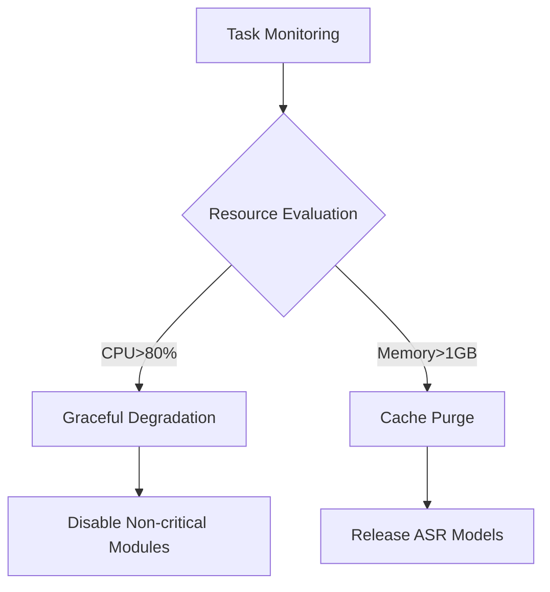
```mermaid
graph TD
    A[Task Monitoring] --> B{Resource Evaluation}
    B -->|CPU>80%| C[Graceful Degradation]
    B -->|Memory>1GB| D[Cache Purge]
    C --> E[Disable Non-critical Modules]
    D --> F[Release ASR Models]
```

Development Roadmap
AI Evolution Strategy:

ChatGPT-o3 and Qwen3.5 large language models were used, and prompt optimization was carried out for the specific api system of nao. The following is a comparison of the technical parameters of ChatGPT-3.5Turbo and Qwen3.5:

| Parameter/Feature       | ChatGPT-3.5 Turbo (OpenAI)           | Qwen3.5 (Alibaba Tongyi Qianwen)     |
|-------------------------|--------------------------------------|--------------------------------------|
| **Model Architecture**  | Improved GPT-3.5 Transformer decoder | Custom MoE (Mixture of Experts)      |
| **Parameter Count**     | ~20B–30B (not fully disclosed)       | Base: 14B, Expert-combined: 200B+    |
| **Training Data**       | Multilingual (cutoff: Sep 2021)      | Chinese-English focused              |
| **Context Window**      | 4k tokens (16k available)            | 32k tokens                           |
| **Inference Speed**     | ~300–500ms (API latency)             | ~20% faster in Chinese               |
| **Language Strength**   | English, multi-turn chat             | Chinese (idioms, poetry)             |
| **Multimodal Support**  | Via separate APIs (e.g., DALL·E)     | Vision/speech integration possible   |
| **Domain Adaptation**   | Needs prompt engineering             | Pre-fine-tuned versions available    |
| **Open-Source**         | No                                   | Partial (e.g., Qwen-7B)              |
| **Safety**             | RLHF + content filtering             | Compliance filters                   |
| **Hardware**           | Cloud-based                          | Edge-device compatible               |
| **Xiao NAO Usage**     | General dialogue, English            | Chinese NLP, technical terms        |


### Experimental Plan

### Real-time Guarantee

### Safety Design

## Final Project Deliverables

### 1. Model Validation Report
### 2. Scenario Testing Results

## License

This project is licensed under the MIT License.
